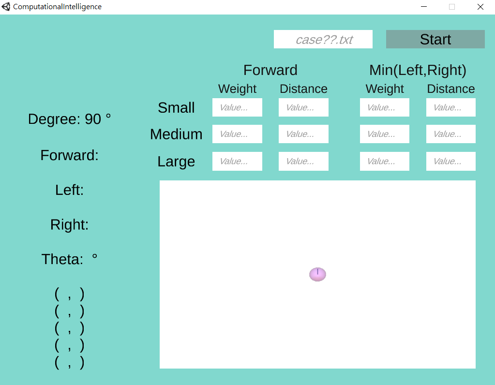
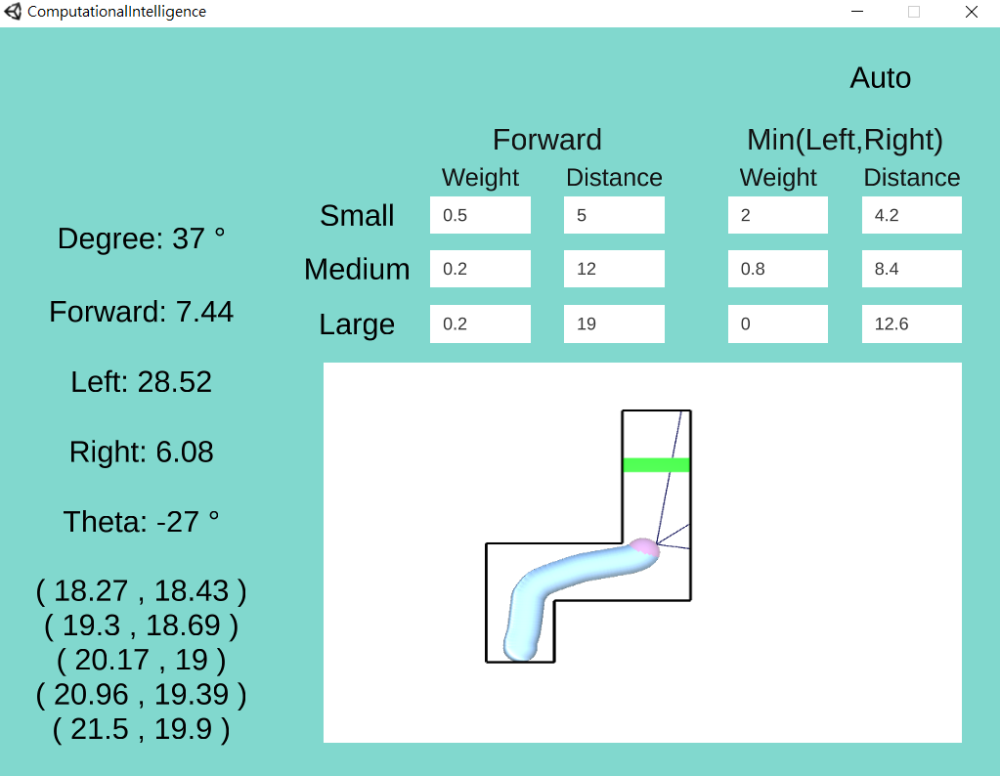

Overview
===
It's the first homework in Computational Intelligence.

 Use fuzzy rule to calculate appropriate steering wheel degree ***θ*** to make car(player) rotate, finally go to the goal without hit the wall.

 The exe file is **/執行檔/104502518_劉冠聲_HW1_V01.exe**, please view the **104502518_劉冠聲_HW1_V01.pdf** before execute exe file.

The case.txt format and physical rule is written in **rule.pdf**.

